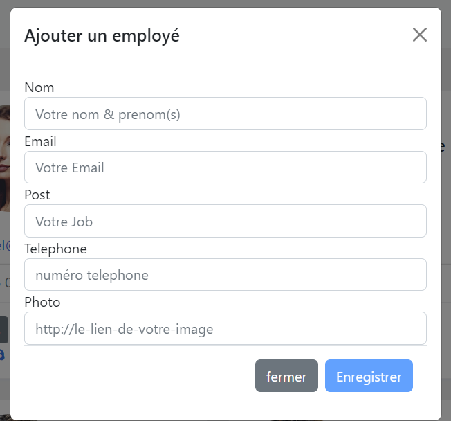

# Employeeapp

This project was generated with [Angular CLI](https://github.com/angular/angular-cli) version 14.2.3.

## Development server
After clone this repo :
Run `ng serve` for a dev server. Navigate to `http://localhost:4200/`.

### Features
<ul>
    <li>Ajouter un employé</li>
    <li>Modifier un employé</li>
    <li>Supprimer un employé </li>
    <li>Lire les employés depuis l'API </li>
    <li> Rechercher un employé</li>
</ul>

### Démo en captures 

     
     
    
    
    
    

#### Ne pas hesiter à forker, lâcher une étoile et/ou telecharger le projet. A bientôt et surtout développez-vous bien !

## Further help

To get more help on the Angular CLI use `ng help` or go check out the [Angular CLI Overview and Command Reference](https://angular.io/cli) page.
